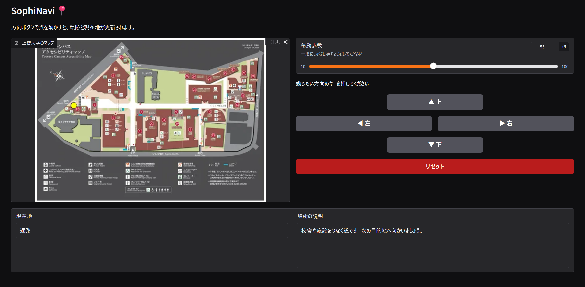

# SophiNavi(2025/07/19)

## アプリケーション概要

* **使用者ターゲット**: 上智に初めて来た、または上智のことについてもっと知りたい人
* **利用することによる利点**: 上、下、右、左のボタンを押すだけで、キャンパスを実際にツアーしているかのように、上智の各建物を知ることができる。

## アプリケーションの使い方

 

### ① マップ表示
* 上智大学の地図です。
* 現在地は、黄色の点で表示されます。
* 初期の地は北門になります。
* 動いた場所は、赤線で表示されます。

### ② 移動歩数の設定
* 点の動く幅を変えることができます。初期値は55ポイントになっています。
* 数字を入力するか、スライダーを動かし、調整します。

### ③ 移動・操作ボタン
* 点を動かすことができます。
* 動かしたい方向のキーを押すことで、②で設定した幅だけ動きます。
* リセットボタンを押すと、北門に戻ります。

### ④ 現在地の表示
* 現在地がどこか書かれます。
* 紹介ポイントになっている箇所以外は、「通路」と表示されます。

### ⑤ 場所の説明
* 現在地についての紹介が書かれます。